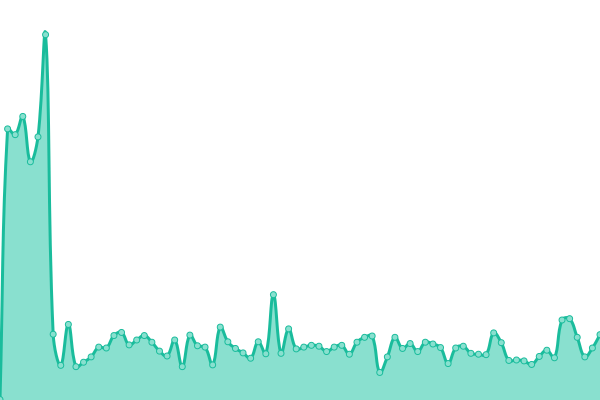
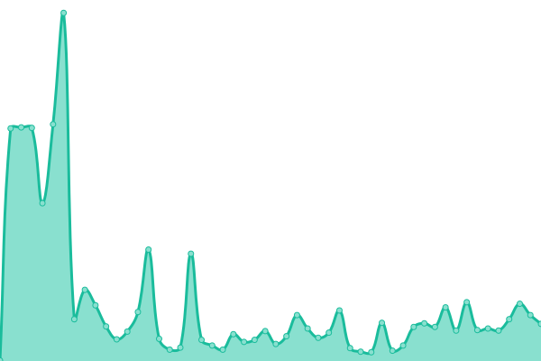
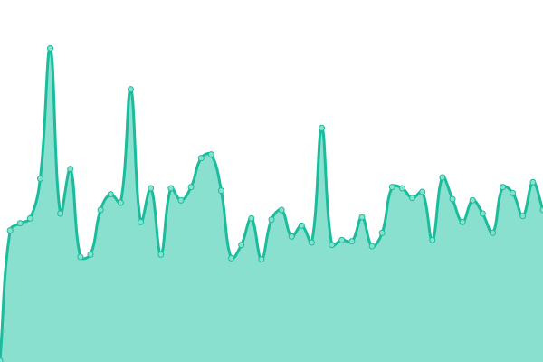
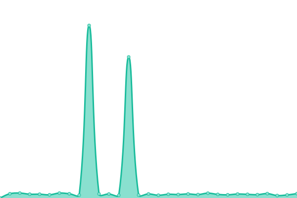

# [📈 Live Status](https://status.evvsk.it): <!--live status--> **🟧 Partial outage**

This repository contains the open-source uptime monitor and status page for [evvsk](https://status.evvsk.it), powered by [Upptime](https://github.com/upptime/upptime).

With [Upptime](https://upptime.js.org), you can get your own unlimited and free uptime monitor and status page, powered entirely by a GitHub repository. We use [Issues](https://github.com/evvsksh/uptime/issues) as incident reports, [Actions](https://github.com/evvsksh/uptime/actions) as uptime monitors, and [Pages](https://status.evvsk.it) for the status page.

<!--start: status pages-->
<!-- This summary is generated by Upptime (https://github.com/upptime/upptime) -->
<!-- Do not edit this manually, your changes will be overwritten -->
<!-- prettier-ignore -->
| URL | Status | History | Response Time | Uptime |
| --- | ------ | ------- | ------------- | ------ |
|  [Mirror](https://mirror.evvsk.it) | 🟩 Up | [mirror.yml](https://github.com/evvsksh/uptime/commits/HEAD/history/mirror.yml) | 

 75ms
     
 | 

<a href="https://status.evvsk.it/history/mirror">100.00%</a>
    

|  [Homepage](https://evvsk.it) | 🟩 Up | [homepage.yml](https://github.com/evvsksh/uptime/commits/HEAD/history/homepage.yml) | 

 119ms
     
 | 

<a href="https://status.evvsk.it/history/homepage">100.00%</a>
    

|  [Archive](https://archive.evvsk.it) | 🟩 Up | [archive.yml](https://github.com/evvsksh/uptime/commits/HEAD/history/archive.yml) | 

 140ms
     
 | 

<a href="https://status.evvsk.it/history/archive">100.00%</a>
    

|  [TCC](https://tcc.evvsk.it/api/health) | 🟥 Down | [tcc.yml](https://github.com/evvsksh/uptime/commits/HEAD/history/tcc.yml) | 

 151ms
     
 | 

<a href="https://status.evvsk.it/history/tcc">100.00%</a>
    

|  [Proxy](https://proxy.evvsk.it) | 🟩 Up | [proxy.yml](https://github.com/evvsksh/uptime/commits/HEAD/history/proxy.yml) | 

 196ms
     
 | 

<a href="https://status.evvsk.it/history/proxy">100.00%</a>
    

|  MC Proxy | 🟩 Up | [mc-proxy.yml](https://github.com/evvsksh/uptime/commits/HEAD/history/mc-proxy.yml) | 

 121ms
     
 | 

<a href="https://status.evvsk.it/history/mc-proxy">100.00%</a>
    

<!--end: status pages-->

[**Visit our status website →**](https://status.evvsk.it)

## 📄 License

- Powered by: [Upptime](https://github.com/upptime/upptime)
- Code: [MIT](./LICENSE) © [Anand Chowdhary](https://anandchowdhary.com), supported by [Pabio](https://pabio.com)
- Data in the `./history` directory: [Open Database License](https://opendatacommons.org/licenses/odbl/1-0/)
